# Product Requirements Document (PRD)
## RailsForge / Ruby & Rails Supercharged All-in-One Extension

- **Project Name:** `ruby-rails-extension` (RailsForge)
- **Target Platforms:** VS Code, Cursor IDE, VSCodium, Windsurf
- **Primary Languages:** TypeScript (Extension Host), Ruby (LSP & Language Tools)
- **Author/Owner:** Shubham Taywade
- **Status:** Approved / In Development

---

## 1. Executive Summary & Vision

Developers working with **Ruby and Ruby on Rails** currently suffer from fragmented toolchains. A typical developer must install 6 to 10 separate extensions:
1. A base Ruby LSP (Shopify `ruby-lsp` or `solargraph`)
2. A separate Rails navigation extension (`rails-go-to-spec`, `rails-navigation`)
3. A RuboCop extension (`ruby-rubocop` or `rubocop-lsp`)
4. A view helper extension (`vscode-erb`, `haml`, `slim`)
5. A testing runner (`vscode-rtest`, `vscode-jest-runner`)
6. A security scanner (`brakeman`)
7. An AI coding helper with zero intrinsic Rails schema/route context.

**RailsForge** is the unified, all-in-one developer platform for **Ruby and Ruby on Rails**. It combines deep language intelligence, full-stack Rails context (Schema, Routes, Associations, Views, Migrations), automated static analysis (RuboCop, Rails Best Practices, RubyCritic, Brakeman), architectural refactoring assistants, and a local AI Agent (`@rails`) grounded in the active application's database schema, route tables, and conventions.

---

## 2. Core Pillars & Architecture

```mermaid
graph TD
    User([Developer in VS Code / Cursor]) --> Ext[RailsForge Extension Host]
    
    subgraph Language_Core [1. Language & LSP Engine]
        Ext --> RubyLSP[Ruby LSP / Prism AST Parser]
        Ext --> Solargraph[Solargraph Adapter]
        Ext --> Sorbet[Sorbet / Steep Typing]
    end
    
    subgraph Rails_Intelligence [2. Rails Ecosystem Intelligence]
        Ext --> MVCSwitcher[Fast MVC & File Switcher]
        Ext --> RouteResolver[Routes & URL Helper Resolver]
        Ext --> SchemaExplorer[Schema Peek & Association Engine]
        Ext --> ViewNavigator[Partial & View Definition Jump]
    end
    
    subgraph Quality_Security [3. Static Analysis & Security]
        Ext --> RuboCopEngine[RuboCop / RuboCop-Rails LSP]
        Ext --> BestPractices[Rails Best Practices Engine]
        Ext --> RubyCritic[RubyCritic / Complexity Profiler]
        Ext --> BrakemanEngine[Brakeman Security Scanner]
    end
    
    subgraph Refactoring_Engine [4. Architecture & Refactoring]
        Ext --> ExtractService[Extract Service / Query / Form Object]
        Ext --> NPlusOne[N+1 Query & Perf Detector]
        Ext --> SOLIDAdvisor[SOLID Design Principles Advisor]
    end
    
    subgraph Testing_Ecosystem [5. Testing & Debugging]
        Ext --> RSpecRunner[RSpec / Minitest Live Runner]
        Ext --> FactoryBotIntelli[FactoryBot & Fixture Resolver]
        Ext --> RDBG[Ruby Debugger: rdbg / pry]
    end
    
    subgraph AIAgent [6. Local AI Agent & Ollama]
        Ext --> RailsChatParticipant[Chat: @rails & Slash Commands]
        Ext --> OllamaClient[Local Ollama / LLM Backend]
        Ext --> SelfRepairLoop[Test & Lint Self-Repair Loop]
    end
```



---

## 3. Detailed Functional Requirements

### 3.1 Pillar 1: Language Server & IntelliSense (LSP)
- **Universal Engine Support:** Automatic detection and seamless bridging with `ruby-lsp` (Shopify's modern Prism-based parser) or `solargraph` with graceful fallbacks.
- **Symbol Indexing & Hover:** Instant hover documentation for standard library classes, gems, Rails classes, and user code.
- **Smart Autocomplete:** Context-aware completion for constants, instance methods, class methods, block parameters, and keyword arguments.
- **Document Outline & Breadcrumbs:** Fast AST parsing displaying classes, modules, methods, callbacks, and DSL blocks.
- **Go to Definition & Find References:** Precision symbol navigation across files and installed bundler gems (`bundle open` equivalent inside editor).

### 3.2 Pillar 2: Rails Ecosystem Superpowers
- **Instant MVC & Companion Switcher (`Alt+R` / `Cmd+Alt+R`):**
  - Model $\leftrightarrow$ Controller $\leftrightarrow$ Views (index, show, form) $\leftrightarrow$ Helper $\leftrightarrow$ Spec/Test $\leftrightarrow$ Serializer $\leftrightarrow$ Policy $\leftrightarrow$ Service $\leftrightarrow$ Migration.
- **Route Navigation & Auto-completion:**
  - Index `config/routes.rb` in real time.
  - Autocomplete named route helpers (`users_path`, `edit_order_url`, `api_v1_products_path`).
  - Hover over route helpers to see HTTP method, URL pattern, and controller#action mapping.
  - Peek/Jump from route helper directly to the controller action.
- **Schema & Database Intelligence:**
  - Parse `db/schema.rb` or `db/structure.sql` into an in-memory index.
  - Auto-complete model column names on ActiveRecord queries (e.g. `User.where(em...)` $\to$ `email:`).
  - Inline Schema Peek: Hover over any Model class or instance variable to view table columns, types, nullability, and default values.
  - Association resolution: Auto-complete `has_many`, `belongs_to`, `has_one`, `has_and_belongs_to_many`, validating foreign keys and model existence.
- **View & Partial Navigation:**
  - `render "shared/navbar"` $\to$ `Ctrl+Click` jumps directly to `app/views/shared/_navbar.html.erb` (supporting `.erb`, `.haml`, `.slim`).
  - View component support: Peek and jump to `app/components/` classes and template files.

### 3.3 Pillar 3: Quality, Static Analysis & Security
- **RuboCop & RuboCop-Rails Real-time Engine:**
  - Fast background linting using project-local `.rubocop.yml`.
  - Inline code action lightbulbs with 1-click fixes.
  - **Quick Fix Actions:**
    - `RuboCop: Auto-correct this offense` (`-a`)
    - `RuboCop: Auto-correct entire file` (`-a` / `-A`)
    - `RuboCop: Disable cop for line / file`
  - Optional Format on Save via RuboCop.
- **Rails Best Practices:**
  - Detect common Rails anti-patterns: Law of Demeter violations, fat controllers, unused model methods, N+1 query vulnerability candidates.
- **RubyCritic & Complexity Visualizer:**
  - Inline CodeLens or status bar score displaying file ABC complexity (Assignment, Branch, Condition) and churn rating.
- **Brakeman Security Scanner:**
  - On-demand or on-save security audit for SQL injections, command injections, unsafe redirects, mass assignment vulnerabilities, and exposed secrets.

### 3.4 Pillar 4: Architecture, Refactoring & Code Enhancement
- **Design Pattern Extraction:**
  - `Extract to Service Object`: Extracts selected business logic into `app/services/[name]_service.rb` with standard `call` / `perform` idiom.
  - `Extract to Query Object`: Moves complex ActiveRecord chains into `app/queries/[name]_query.rb`.
  - `Extract to Form Object`: Refactors multi-model validation into `app/forms/[name]_form.rb`.
  - `Extract to Policy (Pundit)`: Generates `app/policies/[name]_policy.rb`.
- **SOLID Remediation:**
  - Single Responsibility check: Flags controllers with $> 7$ actions or models with $> 300$ lines.
  - Interface Segregation / Dependency Inversion hints.
- **N+1 Query Detection Heuristics:**
  - Identifies loops accessing associations without preceding `includes` / `eager_load`.

### 3.5 Pillar 5: Testing & Debugging
- **RSpec & Minitest Runner:**
  - Run single test, current context block, or full file with CodeLens `▶ Run Test` | `🐞 Debug Test`.
  - Inline pass/fail gutters and timing measurements.
- **FactoryBot & Fixtures IntelliSense:**
  - Auto-complete factory names (`create(:user)`, `build(:order)`) with attribute hints.
  - Jump from `create(:post)` directly to the factory definition in `spec/factories/posts.rb`.
- **Native Debugger Integration:**
  - 1-click launch configuration for `rdbg` (Ruby 3.1+ native debugger) and `pry`.

### 3.6 Pillar 6: AI Agent & Local LLM Integration (`@rails`)
- **VS Code / Cursor Chat Participant (`@rails`):**
  - Grounded with full project context: schema columns, route helpers, associations, active gemfile, and Rails conventions.
- **Slash Commands:**
  - `@rails /scaffold <name> <fields>`: Generates clean, convention-compliant models, controllers, migrations, and specs.
  - `@rails /service <name>`: Generates decoupled Service Object with error handling and result monads.
  - `@rails /fix`: Analyzes active RuboCop or RSpec failures and applies minimal, non-breaking patches.
  - `@rails /spec`: Generates complete, idiomatic RSpec unit/request tests using FactoryBot.
  - `@rails /migrate`: Generates safe ActiveRecord migration with reversible blocks and index optimizations.
  - `@rails /optimize`: Analyzes query execution, memory churn, and suggests eager-loading optimizations.
- **Self-Repairing Agent Loop:**
  - Proposes code $\to$ Runs `rubocop` / `rspec` $\to$ Captures failures $\to$ Auto-repairs until clean.

---

## 4. User Experience & Keybindings

| Keybinding (Linux/Win) | Keybinding (macOS) | Command Title | Action |
| :--- | :--- | :--- | :--- |
| `Alt+R M` | `Cmd+Alt+R M` | **RailsForge: Go to Model** | Switch to matching model |
| `Alt+R C` | `Cmd+Alt+R C` | **RailsForge: Go to Controller** | Switch to matching controller |
| `Alt+R V` | `Cmd+Alt+R V` | **RailsForge: Go to View** | Select and open matching view |
| `Alt+R S` | `Cmd+Alt+R S` | **RailsForge: Go to Spec/Test** | Switch to matching test file |
| `Alt+R R` | `Cmd+Alt+R R` | **RailsForge: Search Routes** | Interactive route search & copy |
| `Ctrl+Shift+P` $\to$ `RailsForge: RuboCop Autocorrect` | **RailsForge: RuboCop Autocorrect** | Run safe autocorrect on file |
| `Ctrl+Shift+P` $\to$ `RailsForge: Run Brakeman Security Scan` | **RailsForge: Brakeman Scan** | Display security vulnerability report |

---

## 5. Configuration Settings (`package.json`)

```json
{
  "railsForge.lsp.engine": "ruby-lsp",
  "railsForge.rubocop.autocorrectOnSave": true,
  "railsForge.rubocop.mode": "safe",
  "railsForge.brakeman.scanOnSave": false,
  "railsForge.testing.framework": "rspec",
  "railsForge.schema.autoIndex": true,
  "railsForge.routes.autoIndex": true,
  "railsForge.ollama.host": "http://localhost:11434",
  "railsForge.ollama.model": "qwen2.5-coder:14b",
  "railsForge.agent.autoRepair": true
}
```

---

## 6. Implementation Roadmap

| Phase | Objective | Deliverables |
| :--- | :--- | :--- |
| **Phase 1** | Foundation & Project Scaffold | Extension structure, `tsconfig.json`, `package.json`, build pipeline (`esbuild`/`webpack`), test harness (`vitest`). |
| **Phase 2** | Rails Knowledge & Indexing | `SchemaIndexer`, `RoutesIndexer`, `MVCNavigator`, `ViewPartialResolver`. |
| **Phase 3** | Quality & Static Analysis | `RuboCopLspClient`, `BrakemanScanner`, `RailsBestPracticesClient`, `RubyCriticLens`. |
| **Phase 4** | Refactoring & Architecture Engine | `ServiceExtractor`, `QueryExtractor`, `FormExtractor`, `NPlusOneDetector`. |
| **Phase 5** | Testing Integration | `RSpecRunner`, `MinitestRunner`, `FactoryBotIndexer`. |
| **Phase 6** | AI Agent & Chat Participant | `@rails` Chat Participant, Ollama client, Tool calling (`read_schema`, `read_routes`, `run_rspec`, `apply_patch`), Self-repair loop. |
| **Phase 7** | Verification & Packaging | Unit tests, E2E fixtures, VSIX packaging, Performance audit. |

---

## 7. Roadmap: Architectural Guardrail System (Phase 8+)

Positioning: RailsForge is the Rails-specific intelligence layer that sits
*alongside* `ruby-lsp` (Ruby syntax/diagnostics) and TypeScript tooling
(ESLint/Prettier/Tailwind), not a replacement for either — see README
"Relationship to Ruby LSP". The next phases extend that layer from "useful
Rails tools" toward keeping developers inside the project's own patterns and
SOLID/DRY/YAGNI/KISS conventions without opening 5–6 files to check "how did
we do this before."

**Shipped as of this iteration (regex/heuristic, no new native dependencies):**

- `ProjectPatternIndexer` — indexes `app/services|queries|forms|policies|decorators`
  and concerns; `railsforge.showSimilarPatterns` command + CodeLens surface the
  closest existing implementations for a given class.
- `@rails` agent grounding now includes a summary of existing patterns, with an
  explicit "search before generating" instruction in the system prompt.
- `ruby-lsp-addon/` — a companion Ruby gem (`RubyLsp::Addon`) that appends
  schema-aware hover into `ruby-lsp`'s own responses, proving the
  ruby-lsp-complementary integration model end to end for one feature slice.
- **Quick Fix / lightbulb layer on `DesignPrincipleLinter`**: Law of Demeter
  inserts a `delegate :method, to: :receiver`; YAGNI deletes the unused
  method's full block; every principle diagnostic also offers an
  "✨ AI: Suggest fix" action backed by `RailsAgent.suggestCodeFix` (reuses
  the existing Ollama config, no new AI client). `railsforge.fixAllInFile`
  batch-applies the deterministic fixes in a file.
- **`railsforge.extractService` is now a single atomic `WorkspaceEdit`**
  (create service file + insert content + replace only the selected range),
  so VS Code shows one multi-file diff preview and nothing outside the
  selection is touched. Free variables (`params`, `current_user`, any
  `receiver.method` in the selection) are now auto-detected instead of
  always extracting a zero-arg service.
- `MinimalDependencyGraph` (`src/graph/`) — regex-based (no AST library)
  collaborator graph over `ProjectPatternIndexer`'s patterns. Flags
  `PaymentGatewayService.call(...)`-style hard-coded collaborators with a
  "Inject `X` via constructor" Quick Fix that adds a keyword constructor
  param and rewrites call sites in that file to use it, and answers
  "who calls this service" (`getCallers`).
- `RelatedFilesIndex` (`src/graph/`) — reverse index from a model name to the
  services/queries/policies/decorators/concerns that reference it (by name
  match or `Model.find`/`.create`/`.where`-style usage in the body), plus a
  spec/test index keyed by `RSpec.describe`/Minitest `class XTest` subject.
  `RelatedCodeLensProvider` renders `🔗 3 Services · 2 Queries · 1 Policy · 6 Specs`
  on models and `🔗 Called by 7 · Depends on 3 · 2 Specs` on services/queries/
  policies (reusing `MinimalDependencyGraph`); `RelatedHoverProvider` shows the
  same on hover of the `class` line; `railsforge.showRelatedFiles` opens a
  quick-pick to jump straight to any of them. This is Phase 9 below, done.

**Not yet implemented — sized for separate follow-up work, roughly in this
order:**

| Phase | Feature | Why it's separate | Key infra decision |
| :--- | :--- | :--- | :--- |
| 8 | Principle diagnostics engine (expand DRY beyond current heuristics; near-duplicate method detection) | Reuses existing `DesignPrincipleLinter`/`PatternDiagnosticsProvider` scaffolding; mostly incremental | None — stays regex/AST-light |
| 10 | Semantic code search ("find where we charge a card") | Needs either embeddings (Ollama `nomic-embed-text` or similar) or FTS5 | Requires choosing an embedding/index strategy |
| 11 | Cycle detection + richer dependency graph (currently: hard-coded-collaborator + caller lookups only, regex-based) | `MinimalDependencyGraph` shipped this iteration; cycle detection and multi-hop analysis want real AST parsing (constructor params, `include`, nested calls) for reliability at scale | Requires an AST library decision |
| 12 | SQLite-backed semantic index + worker-thread indexing | Only worth it once search/graph need persistence and background reparsing at scale | **Adds a native dependency** (`better-sqlite3` and/or `tree-sitter`) — changes VS Code extension packaging (native module bundling, per-platform prebuilds); needs explicit sign-off before adopting |
| 13 | Guided "Extract Service/Query" that also updates all callers across files + generates a matching spec | Current Extract Service only replaces the local selection; updating callers elsewhere needs the caller index from Phase 11 to be reliable | Builds on 11/12 |
| 14 | MCP server exposing the semantic index + `.cursor/rules` export | Depends on the index existing (10-12) | New process/protocol surface |
| 15 | Stimulus ↔ TypeScript cross-linking (Cmd+Click between `data-controller` and the `.ts` file) | Independent of the above; can be picked up any time | None |

Phase 12 is called out specifically because `better-sqlite3`/`tree-sitter-ruby`
are native Node modules — bundling them into a VS Code `.vsix` requires
per-platform prebuilds and changes the current pure-JS/TS webpack build. That
tradeoff (index scalability vs. packaging complexity) should be an explicit
decision, not an incidental side effect of adding search or a dependency
graph.
